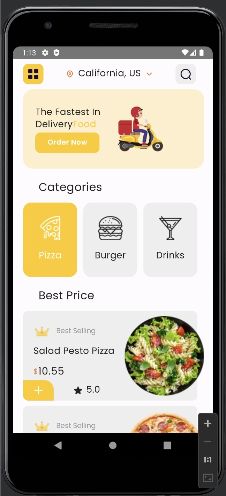
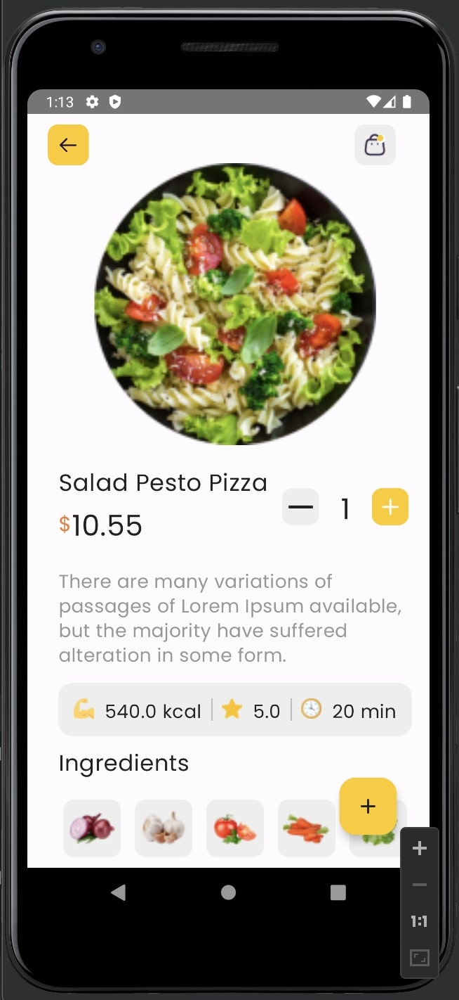

# foodDelivery

This is a simple Jetpack Compose application designed as a Semester Project for the course of Mobile Programming
The aim is to provide a sustainable and working application to satisfy the needs of customers

